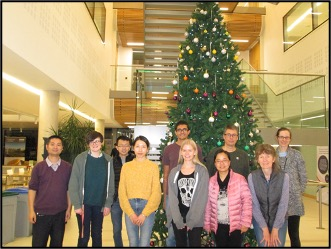

### Lab environment & experimental equipment 
<!--img alt="Z4J1C0410.jpg" src="albums/lab/Z4J1C0410.jpg" title="图1" style="display: inline-block;" width="200" />   
 

### Field experiment station
      

### Activities
#### Thesis defense
   

#### Graduation farewell party (2022-07-15)

#### International academic conferences and academic reports

        
